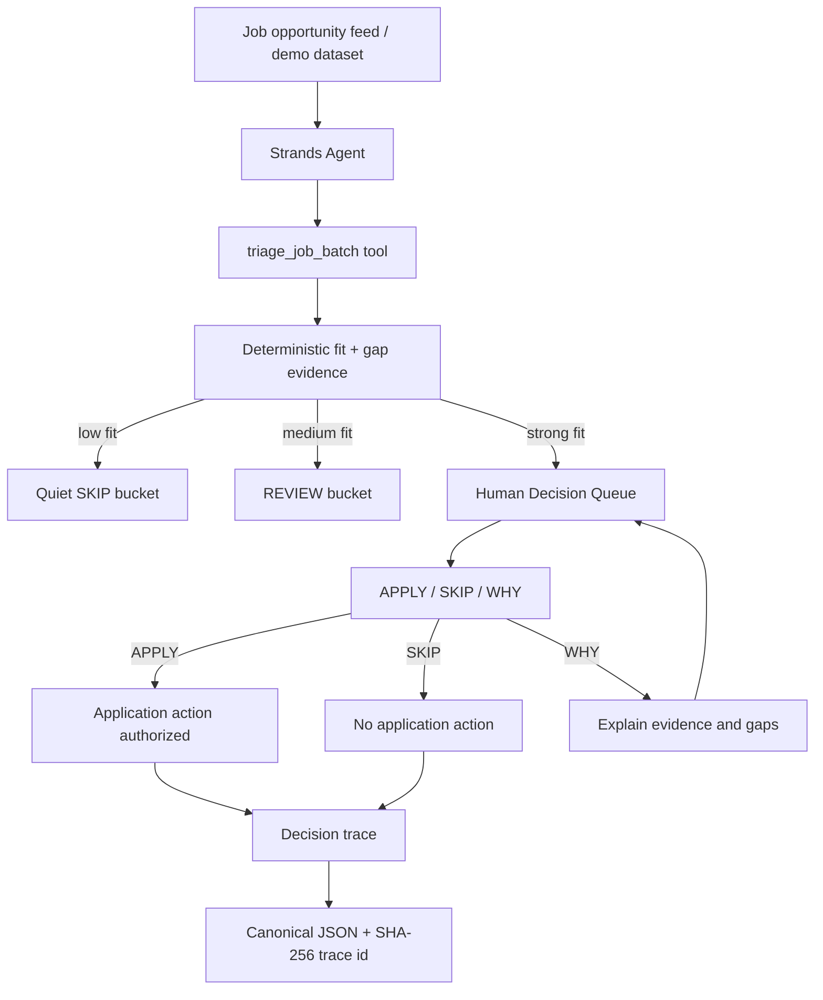

# NextRole Architecture



## Core boundary

NextRole automates repetitive opportunity triage while keeping career-impacting application authority with the human.

The current hackathon MVP intentionally does **not** claim external application submission. `APPLY` means the human authorized a future application action. A later integration may dispatch that action only after this boundary and only when an external system can return its own execution result.

This separation prevents a common agent failure mode: confusing a recommendation or intent with a completed real-world action.

## Current execution path

1. A batch of opportunities and a candidate profile enter `triage_job_batch`.
2. Deterministic code scores each role and records matched and missing evidence.
3. Low-fit jobs stay out of the human queue.
4. Medium-fit jobs are held for review rather than presented as urgent decisions.
5. Only strong opportunities produce the `APPLY / SKIP / WHY` human decision packet.
6. The explicit human choice becomes a deterministic decision trace with a SHA-256 trace id.

The demo fixture is locked by regression tests to a simple judge-readable shape:

```text
5 opportunities
  -> 2 SKIP
  -> 2 REVIEW
  -> 1 HUMAN_DECISION
```

## Strands boundary

The Strands agent owns orchestration and tool selection. The scoring calculation itself is deterministic so the model cannot silently inflate a fit score or erase a missing must-have skill.

The human decision is intentionally **not** exposed as a model-controlled tool. A model may explain or prepare; it cannot fabricate the user's APPLY authorization.

## Planned AWS path

```text
Strands Agents SDK
  -> Amazon Bedrock model
  -> NextRole deterministic tools
  -> lightweight web UI / human gate
  -> Amazon Bedrock AgentCore Runtime (target deployment)
```

AgentCore is a deployment target, not a claim of current deployment. The README and submission should only mark it complete after a live deployment is validated.
