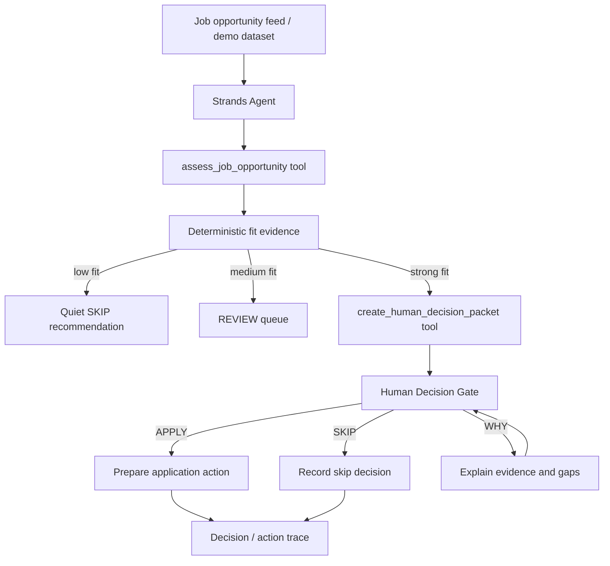

# NextRole Architecture



## Boundary

The Strands agent performs repetitive analysis and preparation. A career-impacting application decision remains human-authorized.

The first hackathon version intentionally does **not** auto-submit applications. That keeps the MVP focused on the core Agents for Humans interaction: background autonomy until a real human decision is required.

## Planned AWS path

```text
Strands Agents SDK
  -> Amazon Bedrock model
  -> NextRole deterministic tools
  -> lightweight web UI
  -> Amazon Bedrock AgentCore Runtime (target deployment)
```

AgentCore is a deployment target, not a claim of current deployment. The README and submission should only mark it complete after a live deployment is validated.
